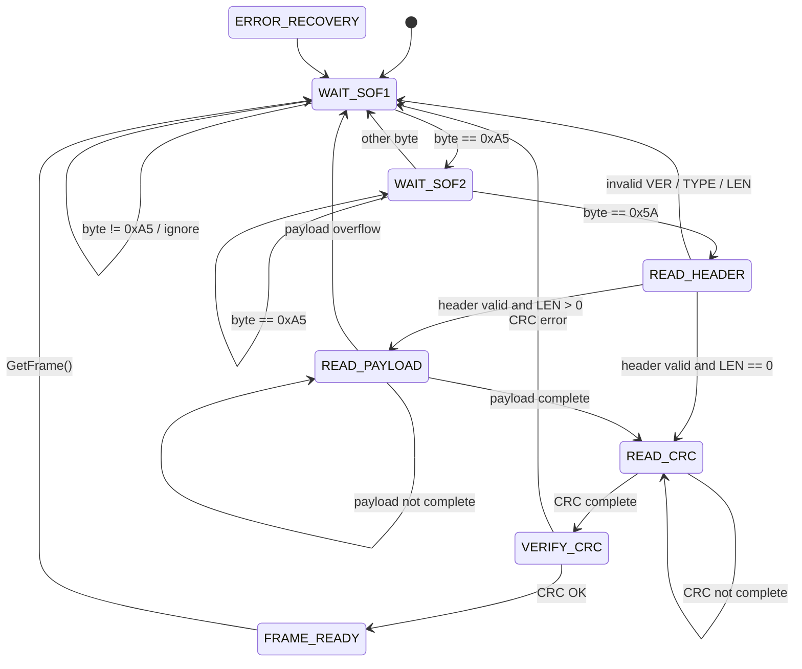

# 06 Protocol Frame Parser State Machine

## 1. Document Purpose

This document describes the design principle and state transition logic of the UART protocol frame parser.

The frame parser is responsible for recovering complete protocol frames from a continuous UART byte stream.

UART itself is a byte stream interface. It does not provide packet boundaries. Therefore, the parser must identify frame boundaries, validate frame length, verify CRC16, and recover from corrupted or noisy byte streams.

This document focuses on:

```text
1. Why the parser is implemented as a state machine
2. How bytes are consumed step by step
3. How each parser state works
4. How state transitions happen
5. How error recovery is handled
6. How the parser works with the existing generic state machine framework
```

---

## 2. Related Modules

The frame parser depends on the following existing modules:

```text
Middleware/state_machine.h
Middleware/state_machine.c
Middleware/crc16.h
Middleware/crc16.c
Middleware/ring_buffer.h
Middleware/ring_buffer.c
Platform/platform_uart.h
Platform/platform_uart.c
```

The frame parser itself belongs to Middleware:

```text
Middleware/protocol_frame.h
Middleware/protocol_frame.c
```

The upper-level protocol scheduler belongs to Services:

```text
Services/protocol_manager.h
Services/protocol_manager.c
Services/command_manager.h
Services/command_manager.c
```

---

## 3. Design Principle

The parser follows these principles:

```text
1. Parser consumes bytes one by one.
2. Parser does not execute commands.
3. Parser does not directly operate UART hardware.
4. Parser only outputs complete and verified frames.
5. Parser rejects invalid frames safely.
6. Parser must recover from garbage bytes.
7. Parser must support half-packet and sticky-packet scenarios.
8. Parser must never cause buffer overflow or HardFault.
9. Parser uses the existing generic StateMachine framework.
```

The parser is a byte-stream recovery mechanism, not a business command module.

---

## 4. Protocol Frame Format

The UART frame format is:

```text
+------+-------+-----+------+-------+-----+-----+--------+---------+-------+
| SOF1 | SOF2  | VER | TYPE | FLAGS | SEQ | CMD | LEN    | PAYLOAD | CRC16 |
| 0xA5 | 0x5A  | 1B  | 1B   | 1B    | 1B  | 1B  | 2B LE  | N bytes | 2B LE |
+------+-------+-----+------+-------+-----+-----+--------+---------+-------+
```

Minimum frame length:

```text
SOF1 + SOF2 + VER + TYPE + FLAGS + SEQ + CMD + LEN + CRC16 = 11 bytes
```

CRC16 coverage range:

```text
VER + TYPE + FLAGS + SEQ + CMD + LEN + PAYLOAD
```

CRC16 does not include:

```text
SOF1
SOF2
CRC16 itself
```

---

## 5. Parser Input and Output

### 5.1 Input

The parser input is one byte at a time:

```c
ProtocolFrameParser_InputByte(&parser, byte, now_ms);
```

The byte source is normally:

```text
UART RX RingBuffer
```

The future data path is:

```text
USART1 RX
  ↓
DMA Circular Buffer
  ↓
DMA Half / Complete / IDLE Event
  ↓
RX RingBuffer
  ↓
ProtocolManager_Process()
  ↓
ProtocolFrameParser_InputByte()
```

### 5.2 Output

When a valid frame is parsed and CRC verification passes, the parser sets:

```text
frame_ready = 1
```

The upper layer then calls:

```c
ProtocolFrameParser_GetFrame(&parser, &frame, now_ms);
```

After the frame is taken, the parser returns to `WAIT_SOF1`.

---

## 6. Parser States

The parser uses the following states:

```text
WAIT_SOF1
WAIT_SOF2
READ_HEADER
READ_PAYLOAD
READ_CRC
VERIFY_CRC
FRAME_READY
ERROR_RECOVERY
```

### 6.1 WAIT_SOF1

Purpose:

```text
Wait for the first start byte 0xA5.
```

Behavior:

```text
If byte == 0xA5:
    clear working buffer
    transition to WAIT_SOF2

Else:
    ignore byte
    sof1_error_count++
    stay in WAIT_SOF1
```

This state allows the parser to skip garbage bytes before a valid frame.

---

### 6.2 WAIT_SOF2

Purpose:

```text
Wait for the second start byte 0x5A.
```

Behavior:

```text
If byte == 0x5A:
    transition to READ_HEADER

Else if byte == 0xA5:
    stay in WAIT_SOF2

Else:
    sof2_error_count++
    transition to WAIT_SOF1
```

Special handling:

```text
A5 A5 5A ...
```

The second `0xA5` may be the beginning of a new frame, so the parser stays in `WAIT_SOF2`.

---

### 6.3 READ_HEADER

Purpose:

```text
Read fixed-length frame header:
VER + TYPE + FLAGS + SEQ + CMD + LEN_L + LEN_H
```

Header length:

```text
7 bytes
```

Behavior:

```text
Collect 7 header bytes.

After header is complete:
    parse VER
    parse TYPE
    parse FLAGS
    parse SEQ
    parse CMD
    parse LEN

If VER is unsupported:
    version_error_count++
    return to WAIT_SOF1

If TYPE is invalid:
    type_error_count++
    return to WAIT_SOF1

If LEN > PROTO_FRAME_MAX_PAYLOAD_SIZE:
    len_error_count++
    return to WAIT_SOF1

If LEN == 0:
    transition to READ_CRC

Else:
    transition to READ_PAYLOAD
```

---

### 6.4 READ_PAYLOAD

Purpose:

```text
Read payload bytes according to LEN.
```

Behavior:

```text
Collect payload bytes until payload_index == payload_len.

If payload buffer overflows:
    len_error_count++
    return to WAIT_SOF1

When payload is complete:
    transition to READ_CRC
```

This state supports half-packet scenarios. If the payload is incomplete, the parser simply waits for more bytes.

---

### 6.5 READ_CRC

Purpose:

```text
Read 2-byte CRC16 field.
```

CRC format:

```text
Little-endian:
CRC_L
CRC_H
```

Behavior:

```text
Collect 2 CRC bytes.

When CRC is complete:
    transition to VERIFY_CRC
```

---

### 6.6 VERIFY_CRC

Purpose:

```text
Verify whether the received CRC matches the calculated CRC.
```

CRC calculation range:

```text
VER + TYPE + FLAGS + SEQ + CMD + LEN + PAYLOAD
```

Behavior:

```text
If calculated_crc == received_crc:
    save ready frame
    frame_ok_count++
    frame_ready_count++
    transition to FRAME_READY

Else:
    crc_error_count++
    discard current frame
    transition to WAIT_SOF1
```

---

### 6.7 FRAME_READY

Purpose:

```text
Hold a complete verified frame for upper layer consumption.
```

Behavior:

```text
Parser stops accepting new frame bytes until upper layer calls:
ProtocolFrameParser_GetFrame()
```

Reason:

```text
This avoids overwriting the ready frame before the upper layer processes it.
```

After `ProtocolFrameParser_GetFrame()`:

```text
clear frame_ready
clear working buffer
transition to WAIT_SOF1
```

---

### 6.8 ERROR_RECOVERY

Purpose:

```text
Reserved state for future complex recovery logic.
```

Current V1 behavior:

```text
transition to WAIT_SOF1
```

Future use:

```text
1. timeout recovery
2. resynchronization optimization
3. parser diagnostic event reporting
```

---

## 7. State Transition Diagram



---

## 8. Byte Stream Examples

### 8.1 Normal Frame

```text
A5 5A 01 01 00 01 01 00 00 CRC_L CRC_H
```

State sequence:

```text
WAIT_SOF1
WAIT_SOF2
READ_HEADER
READ_CRC
VERIFY_CRC
FRAME_READY
WAIT_SOF1
```

---

### 8.2 Garbage Bytes Before Frame

Input:

```text
00 11 22 A5 5A 01 01 00 01 01 00 00 CRC_L CRC_H
```

Behavior:

```text
00 ignored in WAIT_SOF1
11 ignored in WAIT_SOF1
22 ignored in WAIT_SOF1
A5 enters WAIT_SOF2
5A enters READ_HEADER
frame parsed normally
```

---

### 8.3 Half Packet

Input part 1:

```text
A5 5A 01 01 00
```

Parser state:

```text
READ_HEADER
```

Input part 2:

```text
01 01 00 00 CRC_L CRC_H
```

Parser continues reading and finally reaches:

```text
FRAME_READY
```

The parser does not require all bytes to arrive at once.

---

### 8.4 Sticky Packets

Input:

```text
Frame1 Frame2 Frame3
```

Behavior:

```text
Parser extracts Frame1.
Upper layer calls GetFrame().
Parser returns to WAIT_SOF1.
Parser continues parsing Frame2 and Frame3.
```

Sticky packet handling is mainly implemented by the Protocol Manager loop.

---

### 8.5 CRC Error Frame

Input:

```text
A5 5A 01 01 00 01 01 00 00 WrongCRC_L WrongCRC_H
```

Behavior:

```text
Parser reads full frame.
Parser calculates CRC.
CRC mismatch.
crc_error_count++.
Frame discarded.
Parser returns to WAIT_SOF1.
```

---

## 9. Parser Statistics

The parser should expose the following statistics:

```text
input_bytes
frame_ok_count
frame_ready_count
sof1_error_count
sof2_error_count
version_error_count
type_error_count
len_error_count
crc_error_count
busy_drop_count
reset_count
```

Purpose:

```text
1. Diagnose noisy byte stream
2. Diagnose CRC corruption
3. Verify parser recovery ability
4. Support future GET_STATUS / GET_PROTOCOL_STATS command
```

---

## 10. Relationship with Generic State Machine Framework

The parser uses the existing generic state machine framework:

```c
StateMachine_t sm;
```

Each parser state is registered as a `StateDef_t`:

```c
static const StateDef_t g_protocol_frame_state_table[] =
{
    { WAIT_SOF1, NULL, NULL, OnWaitSof1 },
    { WAIT_SOF2, NULL, NULL, OnWaitSof2 },
    { READ_HEADER, NULL, NULL, OnReadHeader },
    { READ_PAYLOAD, NULL, NULL, OnReadPayload },
    { READ_CRC, NULL, NULL, OnReadCrc },
    { VERIFY_CRC, NULL, NULL, OnVerifyCrc },
    { FRAME_READY, NULL, NULL, OnFrameReady },
    { ERROR_RECOVERY, NULL, NULL, OnErrorRecovery },
};
```

Byte input is converted into a state machine event:

```c
StateMachine_Dispatch(&parser->sm, PROTO_FRAME_EVT_BYTE, &byte_event);
```

State transitions are performed through:

```c
StateMachine_Transition(&parser->sm, next_state, now_ms);
```

The parser does not implement its own independent state machine framework.

---

## 11. Test Strategy

Parser tests must follow the project test convention:

```text
1. Test code is integrated into app_main.c
2. Test execution is controlled by ENABLE_xxx_TEST macros
3. Test macros are disabled by default
4. Test runs once in App_Init()
5. Test must not affect normal App_Run()
```

Recommended macro:

```c
#define ENABLE_PROTOCOL_FRAME_TEST 0
```

Recommended test function:

```c
static void App_TestProtocolFrame(void);
```

Recommended App_Init integration:

```c
#if ENABLE_PROTOCOL_FRAME_TEST
    App_TestProtocolFrame();
#endif
```

---

## 12. Self Test Coverage

The first self test should cover:

```text
1. Build PING frame
2. Feed garbage bytes before valid frame
3. Parse valid PING frame
4. Check frame type
5. Check sequence number
6. Check command ID
7. Check zero-length payload
8. Corrupt CRC byte
9. Verify corrupted frame is rejected
10. Verify crc_error_count increases
```

Expected result:

```text
[INFO] ProtocolFrame Test Start
[INFO] ProtocolFrame self test = PASS
[INFO] ProtocolFrame Test End
```

---

## 13. Current Stage

```text
Stage 2.6.1: Protocol Frame Parser State Machine Design
```

Next step:

```text
Stage 2.6.2: Protocol Frame Module Implementation
```
